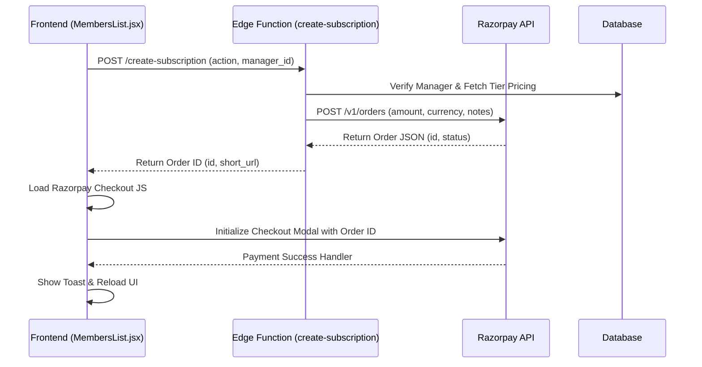

# Razorpay Checkout Flow

## Overview

ArukinSec handles monetization and upgrades using Razorpay. The system allows Managers to upgrade their accounts to a PRO tier (either weekly or yearly) and to purchase additional target monitoring slots.

The checkout flow spans the frontend React application, the `create-subscription` Supabase Edge Function, and the Razorpay Orders API.

## High-Level Architecture



## Expected JSON Input

The `create-subscription` edge function expects a JSON payload containing:

```json
{
  "manager_id": "<uuid of the manager>",
  "plan_id": "<optional string, fallback to env var>",
  "action": "upgrade" | "add-slot" | "weekly-license"
}
```

> [!IMPORTANT]
> The edge function includes strict authorization checks. The authenticated user must match the manager profile linked to the `manager_id` provided in the payload. A manager can only create subscriptions for themselves.

## Price Resolution Logic

The edge function dynamically determines the `amount` based on the `action` provided:

1. **`add-slot` (Add-On):**
   - Amount: `120000` paise (₹1,200)
   - Prerequisite: Manager must currently have a `PRO` tier with a `yearly` billing cycle. 

2. **`weekly-license` (1-Week PRO):**
   - Amount: Fetched dynamically from the `tiers` table (`slot_price_weekly` * 100).
   
3. **`upgrade` (Annual PRO):**
   - Amount: Fetched dynamically from the `tiers` table (`slot_price_yearly` * 100).

## Razorpay Order Creation

The edge function calls `https://api.razorpay.com/v1/orders` to create a standard order. It injects critical metadata into the `notes` object:

```json
{
  "notes": {
    "manager_id": "<uuid>",
    "action": "<action>",
    "email": "<manager_email>"
  }
}
```

This metadata is crucial because it is echoed back in the Razorpay webhook payload, allowing the backend to fulfill the purchase.

## Frontend Handling

Upon receiving the `id` from the edge function, the frontend dynamically loads `https://checkout.razorpay.com/v1/checkout.js` (if not already loaded) and initializes the checkout modal using `window.Razorpay(options)`. 

Upon a successful transaction, the handler shows a success toast and triggers a `window.location.reload()` to reflect the new state, relying on the webhook to process the backend upgrade asynchronously.
